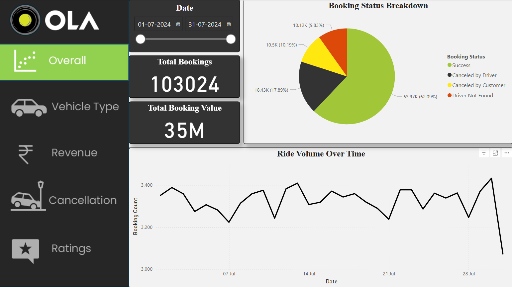
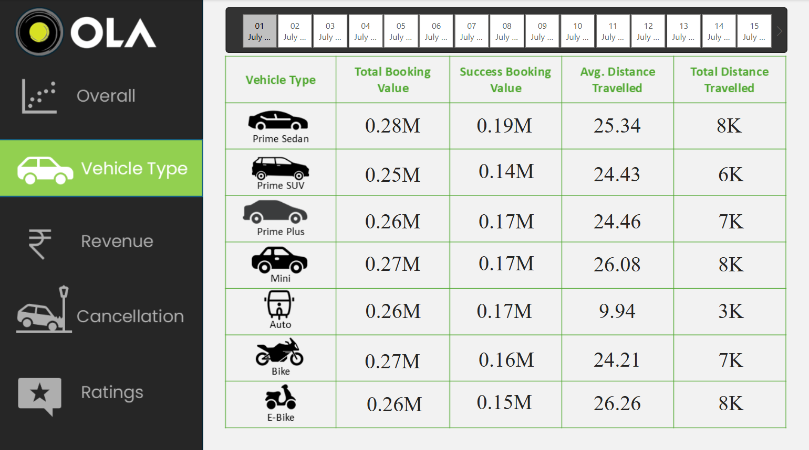
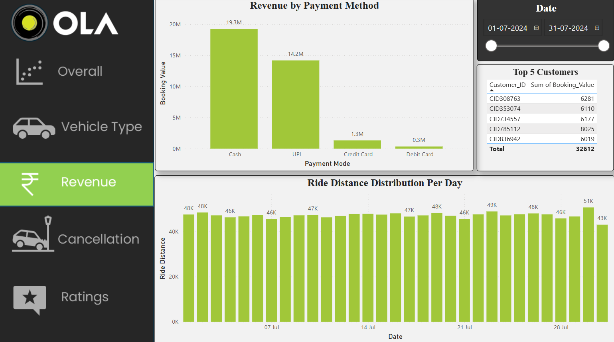
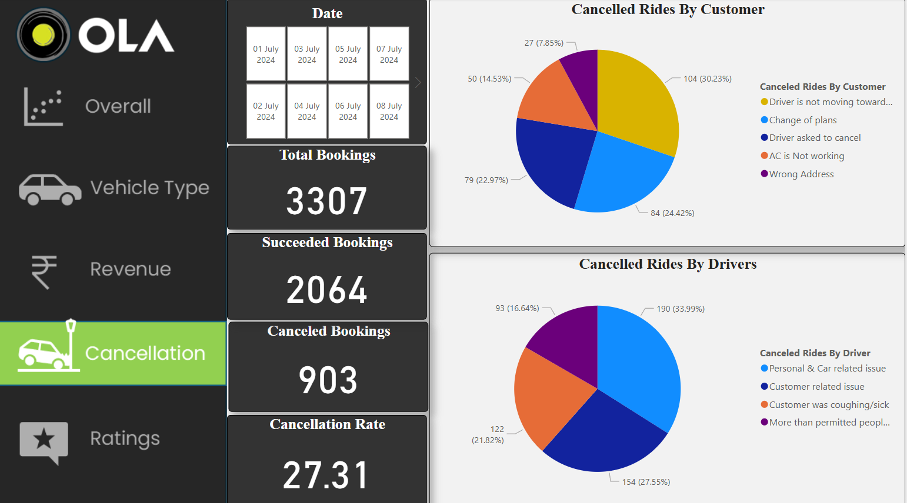
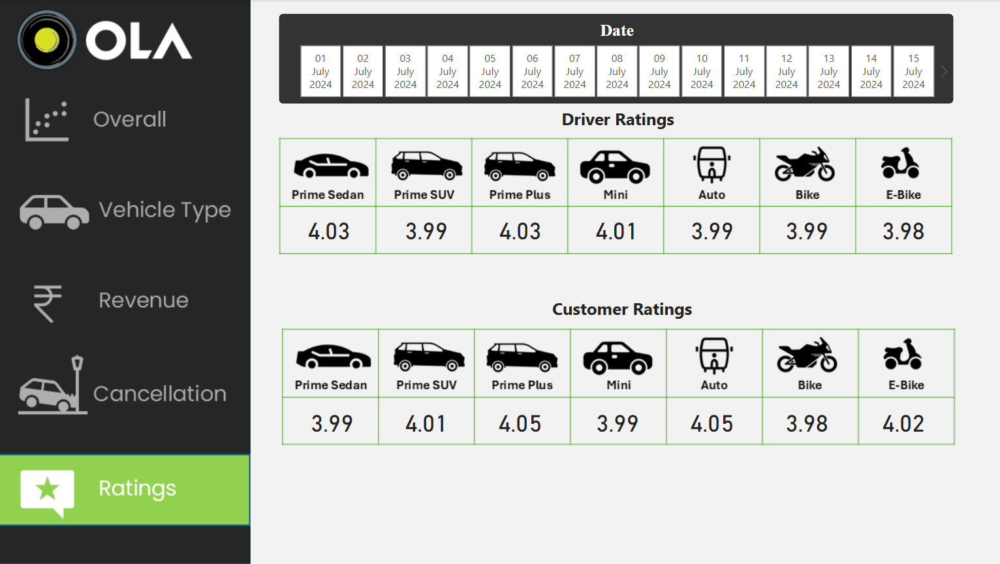

# 🚖 Ola Cab Booking Data Analysis using SQL and Power BI

This project presents a detailed analysis of Ola cab booking data using **PostgreSQL** and **Power BI**. The goal is to understand customer behavior, booking trends, and driver performance through structured SQL logic and interactive dashboards.

---

## 📊 Project Overview

- **Project Type**: Data Analysis & Visualization  
- **Tools Used**: PostgreSQL, SQL, Power BI, DAX  
- **Dataset**: Ola Cab Booking Data (CSV & Excel)  
- **Objective**: To extract meaningful insights from raw ride booking data and present them visually for smarter business decisions.

---

## 🔄 Workflow Summary

1. Created a PostgreSQL database and table structure in **pgAdmin4**.  
2. Imported data from `Bookings.csv` into the PostgreSQL `booking` table.  
3. Wrote SQL queries and created multiple views for data preprocessing (e.g., successful bookings, ride distance averages, cancellation counts).  
4. Exported cleaned data to Excel and connected it to Power BI.  
5. Performed additional transformation in Power BI using Power Query.  
6. Built interactive dashboards using **DAX**, filters, and slicers for real-time insights.

---

## ✅ Key Features

- **Dashboard Overview** with total bookings, average ratings, and demand per city.  
- **Booking Time Analysis** to identify peak and low demand hours.  
- **Vehicle Type Insights** showing user preference for Prime Sedan, Mini, Auto, etc.  
- **Driver Ratings Visualization** to monitor service quality.  
- **Emergency vs Scheduled Bookings** to understand urgent booking behavior.  
- **Cancellation & Incomplete Ride Analysis** using SQL-based breakdowns.  
- **Revenue Visualization** using booking value aggregates.

---

## 🧠 Skills Demonstrated

- SQL Table Design and View Creation in PostgreSQL  
- Data Cleaning and Aggregation using SQL  
- Power BI Data Import and Transformation  
- Use of DAX for calculated columns and measures  
- Charting, Slicer Filters, and Dashboard Design  
- Performance optimization by using SQL logic for heavy queries

---

## 🖼️ Screenshots

### Overall Dashboard

### Vehicle Type Analysis

### Revenue Analysis

### Cancellation Insights

### Driver Rating Overview

---

## 📂 File Structure

Ola-Cab-Booking-Analysis/
│
├── Ola Data Analysis.pbix          # Power BI dashboard file
├── Ola_Sql_Query.sql               # SQL script for creating tables, views, and queries
├── Bookings.xlsx                   # Cleaned Excel data used in Power BI
├── README.md                       # Project documentation
├── Cancellation.png                # Screenshot: Cancellation analysis
├── Overall.png                     # Screenshot: Booking overview
├── Rating.png                      # Screenshot: Driver rating insights
├── Revenue.png                     # Screenshot: Revenue visualization
├── Vehicle_Type.png                # Screenshot: Vehicle type preference

